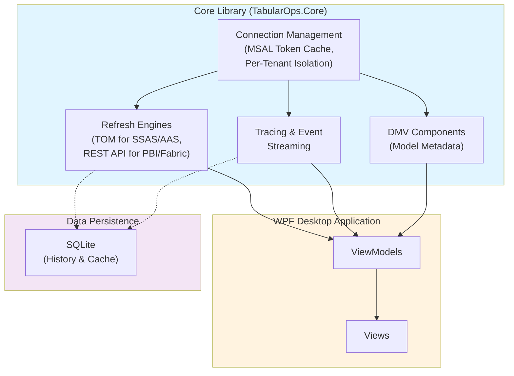

# Architecture Overview

This document provides a high-level architectural view of the TabularOps system.

## System Architecture

## Design Principles

- **Zero UI Dependencies in Core**: Core library maintains no references to WPF, ensuring reusability
- **Per-Tenant Isolation**: Connection management enforces tenant boundaries via MSAL token cache
- **Dual Refresh Paths**: 
  - TOM-based for SSAS/AAS models
  - REST API-based for Power BI and Fabric datasets
- **Event-Driven Tracing**: Streaming event model for real-time monitoring
- **Persistent History**: SQLite backing for refresh history and connection cache

## Key Components

### Core Library (TabularOps.Core)
The foundational layer containing:
- **Connection Management**: Handles multi-tenant scenarios with MSAL integration
- **Refresh Engines**: Abstracts TOM and REST API refresh operations
- **Tracing**: Event stream for monitoring and diagnostics
- **DMV Queries**: Dynamic Management View access for model metadata

### WPF Desktop Application
Consumer application built on the Core library:
- **ViewModels**: Business logic and state management
- **Views**: XAML-based user interface
- **Data Binding**: MVVM pattern implementation

### Data Persistence
- **SQLite Database**: Stores connection history, cache, and audit trails